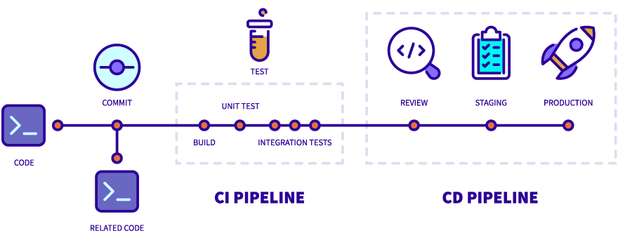
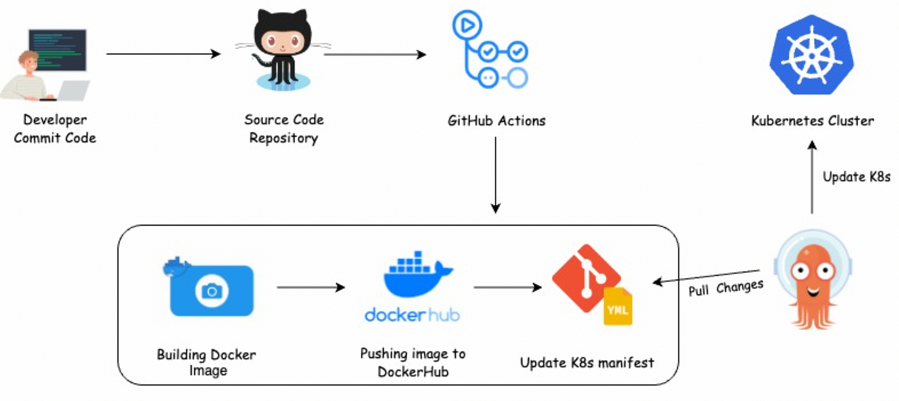
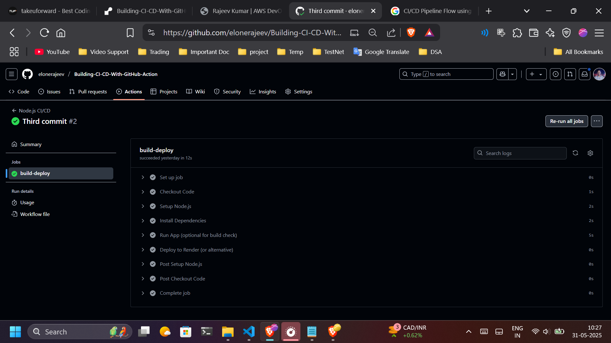
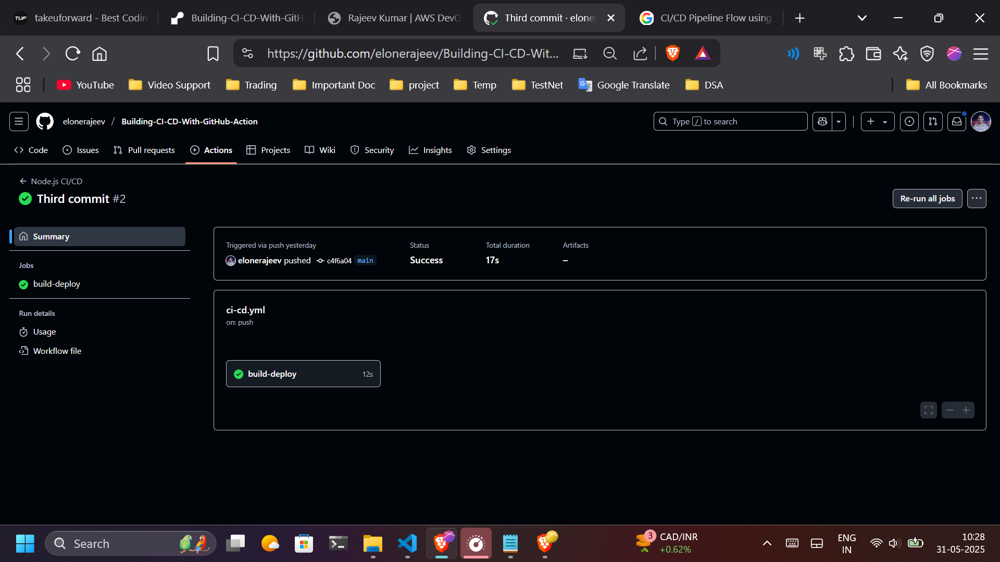

# 🚀 Node.js CI/CD with GitHub Actions + Render + Azure Cloud✨

Welcome to my **Node.js Demo Profile App** with a fully working **CI/CD pipeline** using **GitHub Actions** and **Render** and **Azure Cloud**! 🎯  
This project shows how modern DevOps workflows work — from writing code to testing, validating, and deploying it automatically!

---

## 📸 Project Preview

<div align="center">
  
  
  
  
  
</div>

---

## 📂 Project Structure

```

📦 My-Node-CICD-App/
├── .github/
│   └── workflows/
│       └── ci-cd.yml  ← CI/CD Workflow File ⚙️
|        └── Azure-pipelines-static-web-app.yml
├── views/
│   └── index.html     ← Frontend HTML 🖼️
├── app.js             ← Node.js Backend 🧠
├── package.json       ← Dependencies & Scripts 📦
└── README.md          ← This file 📘

````

---

## 🚧 What This Project Does

✅ Simple Node.js server to display a demo profile  
✅ GitHub Actions pipeline that:
- Installs dependencies
- Checks code syntax (linting)
- Optionally runs tests
- Deploys only **if everything passes**

✅ Deployed to [Render](https://render.com)
✅ Deployed to [Azure](https://azure.com)

---

## 🛠️ Technologies Used

- **Node.js**
- **HTML**
- **GitHub Actions**
- **Render (Deploy Platform)** / - **Azure (Deploy Platform)**
- **ESLint** for syntax checks

---

## 🔁 CI/CD Pipeline Flow




1. ✅ Developer pushes code to GitHub
2. ⚙️ GitHub Actions runs:
   - `npm install`
   - `npx eslint`
   - (optional) `npm test`
3. 🚫 If there are **syntax errors or failed tests**, CI fails and **deployment stops**
4. ✅ If CI passes, GitHub triggers **Render Deploy Hook**
5. 🚀 Render deploys the latest correct code  
6. 📬 You get notified if CI fails

---

## 🔐 Safety Feature

- 🔒 **Render only deploys valid code**
- ❌ Broken code is **blocked by CI**
- 🔁 Old working version stays live

---

## 📸 Example CI Run


> From GitHub → Actions Tab



---

## 📄 How to Use / Setup This

```bash
# 1. Clone the repo
git clone https://github.com/elonerajeev/Building-CI-CD-With-GitHub-Action.git

# 2. Install dependencies
npm install

# 3. Run the app locally
node app.js
````

---

## 🌐 Live Demo

🖥️ Deployed App: [Visit Now --> Live View](https://building-ci-cd-with-github-action.onrender.com/#home)

---

## 🧠 Developer Notes

* You can improve this pipeline by adding:

  * Unit tests
  * Secret scanning
  * Auto rollback

---

## 💻 Author

👤 **Rajeev Kumar** a.k.a. `Elone.rajeev`
🚀 Passionate AWS DevOps Engineer | 
🌐 [Portfolio Website](https://rajeevxportfolio.netlify.app)
📫 [LinkedIn](https://linkedin.com/in/rajeev-kumar-2209b1243) • [GitHub](https://github.com/elonerajeev)

---

## 🏁 Support & Feedback

If you like this project or learned something, don’t forget to ⭐️ star it and share!

```
